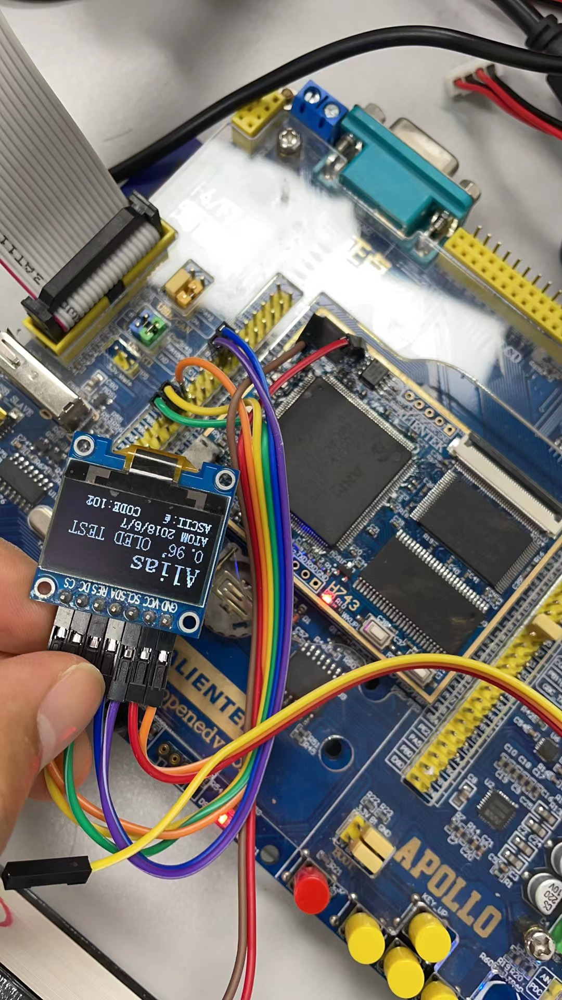

## 说明 ##

```找到一块OLED屏幕，但是没有找到资料，网上有很多类似的，搞清楚了接线方法后打算用手上的正点原子开发板学习一下，于是开始动手！```

---------------------------------

1. 使用的是正点原子的阿波罗H743开发
板
2. 接线如下:
   spi2(PB13/PB14/PB15)
   CS - PG10
   DC - PA13
   RST - PC13
   3.3V供电

3. 代码用的是正点原子的代码


## 测试图片 ##

